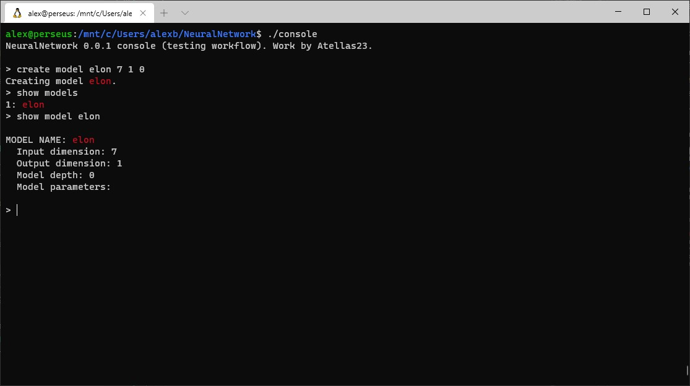
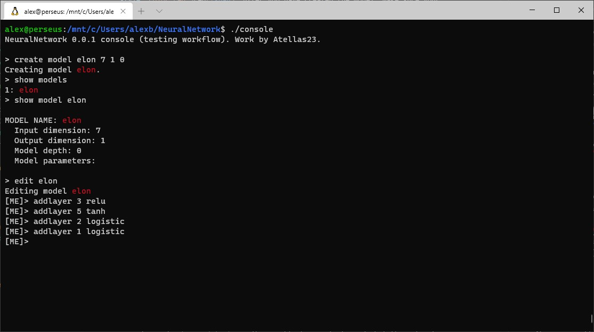
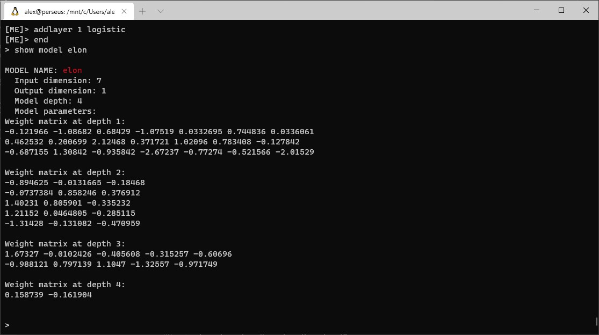
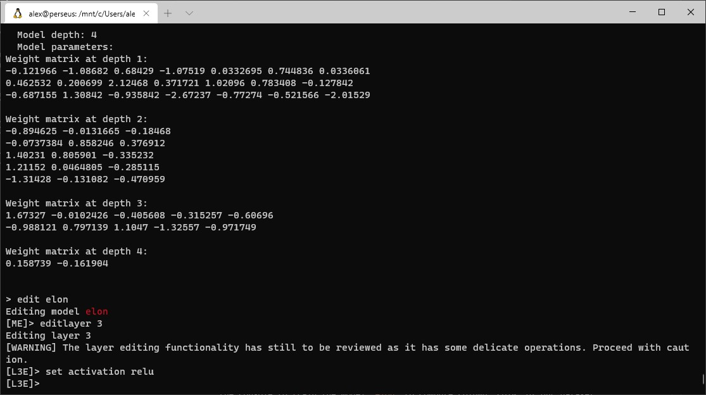
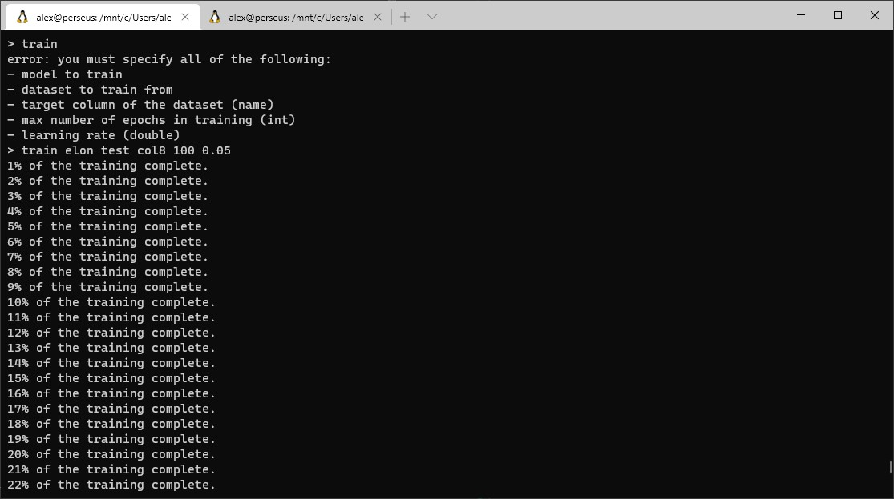

# `NeuralNetwork`: full package documentation (v0.0.1).
## Contents:
0. [Introduction & general usage](#0-introduction-&-general-usage).
1. [Libraries that the CLI uses](#1-libraries-that-the-CLI-uses).
2. [Available operations on models and datasets](#2-available-operations-on-models-and-datasets).
3. [Who am I + contact info](#3-who-am-i).
4. [To-Do list](#4-to-do-list).

----------

## 0. Introduction & general usage.
The `NeuralNetwork` package is a one-author project ([me!](#2-who-am-i)), aiming at creating a console app to use the `NeuralNetwork` library capabilities without having to hardcode the operations and focusing more on the "what to do" instead of the "how to do it". In this sense, this package is a functional approach to the already existing declarative approach.

### 0.0. How to use the `NeuralNetwork` console.
To use the console app, you will have to compile `console_app.cc`. This can be done using the provided `Makefile`, with the instruction `make console`, or with the usual `g++ -Wall -o console console_app.cc -O2 -D_GLIBCXX_DEBUG -std=c++17`. I strongly advice to use the `-D_GLIBCXX_DEBUG`, as it prints a warning whenever your program tries to access out-of-range positions in an array.

## 1. Libraries that the CLI uses.
This console app uses the libraries `neural` and `dataHandler` from the `lib` folder. Both libraries are created and maintained by me. You can have more information on both in their respective documentation files. On a short note, `neural` is the header that implements the multi-layer perceptron classes, creation, edition and training methods, and some utility functions. `dataHandler` is the header charged with the task of implementing the dataset class, its creation methods, and the interactions with persistent text files.

## 2. Available operations on models and datasets.
### 2.0. Models
You can create, erase, edit and train models with this app. We will go through the different commands with an example. Please note that I will be using Windows Subsystem for Linux in the Windows Terminal app, in Windows 10. You shouldn't have any problem if you are using a macOS or a native Linux environment. The use cases are the following:

- **Creating a model:** The first step in creating a model is tell the console to instantiate an object of the `NNet` class. This is done by telling the console `create model {name} {input dimension} {output dimension} {number of layers}`. Usually, and until at least the next full version (1.0.0), output dimension will be 1. Do not worry if you have to change these values afterwards, this is just to initialize a model. Obviously, you can not use the same name for two models, so make sure that you do not. Our example will be the following model: we create a model named `elon`, which will have an input dimension of 7 and an output dimension of 1, with an initial 0 layers:



Note that everything that is a model is conveniently colored in <span style="color:red">red</span>. After you have created the model, make sure your model exists by typing `show models`, and if you are very paranoid, `show model {model name}` will print the details of said model.
After this first (dull, but important) step, you can proceed to add layers to it, or to edit the existing layers. This is done, respectively, through the Model Edit and Layer Edit subconsoles, which I will explain now.
- **Editing a model:** When you want to edit a model, you just have to tell the console to `edit` a model name. Then, a prefix in the command line will appear, `[ME]`, indicating we are in the **M**odel **E**dit subconsole. In our example, we want to edit `elon`, so we will tell the console to `edit elon`:



Now we can add multiple layers to it. I will go for 3 layers of sizes 3, 5, and 2, and activations ReLU, tanh and logistic. And, we can't forget to add the final layer, which will have a size of 1, and a logistic activation, for example. The weights of each neuron in the network are randomly initialized using a zero-centered unit-variance normal distribution. Now, if we want to see again the details of our model, we tell the console to `end` the model editing and then, to show us `elon`:



If we wanted to, we could also edit a particular layer of the model. Say we want to change the activation function of the last layer from logistic to ReLU. We type in `edit elon` again, and within the model edit subconsole, we tell the console to `editlayer 3`:



Observe that the console immediately shows us a warning message about the layer editing subconsole. Inside the **L**ayer **3 E**dit subconsole `[L3E]`, we tell the console to `set activation relu`. We then `end` twice to return to the main console, and `show model elon`. The weights have not changed, but the activation functions have (we cannot see this though). We can also set a name to a layer, though this is a feature more keen to the library usage of the `neural` header.
- **Training a model:** If we want to train a model, we should first have a dataset to train from. Note that if you tell the console to `show datasets`, the list will be empty. So, we should load a dataset from a file. In this case, we will not go into a lot of detail, as this is a matter of section 2.1. We tell the console to load a dataset that looks like this:
```
col1 col2 col3 col4 col5 col6 col7 col8
   1    2    3    4    5    6    7   28
   2    3    4    5    6    7    8   35
   3    4    5    6    7    8    9   42
   4    5    6    7    8    9   10   49
   5    6    7    8    9   10   11   56
   6    7    8    9   10   11   12   63
   7    8    9   10   11   12   13   70
```
Please note that it is not needed that the dataset is perfectly aligned, this is just for aesthetic purposes. Now, to train the model on this dataset, we tell the console to train the model `elon` to compute column 'col8' of our dataset using the other seven columns:



As a last thing, we can save the model to a file using `save elon elonModel`, and we will get a `.NNet` file containing the model information.

## 3. Who am I.
My name's Àlex. I'm a student at **Universitat Politècnica de Catalunya (UPC-BarcelonaTech)**, currently studying the Bachelors of [Mathematics](https://www.fme.upc.edu/en/studies/degrees/bachelors-degree-in-mathematics-1) and [Data Science and Engineering](https://www.dse.upc.edu) through the double-degree plan in [CFIS](https://www.cfis.upc.edu). I'm from a town called Arenys de Munt, a 40-minute car-drive from Barcelona. If you want to contact me, feel free to do so emailing me at [alex.batlle01@gmail.com](mailto:alex.batlle01@gmail.com?subject=GitHub%20NeuralNetwork%20contact).

## 4. To-Do list.
To-do list in order of priority:

- Write more documentation.
- CLI to create, save, load and train objects of the declared classes.
- Additional library to read and write data to files.
